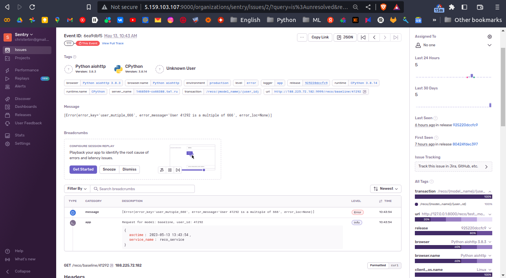

# Report

## Bug tracking

Все ошибки сервиса отображались автоматически с отслеживанием кроме одной: `HTTPException(status_code=HTTP_403_FORBIDDEN, detail="Not authenticated")`, которая отмечена в баг-трекере как `<unlabeled event>`. Данный *Exception* хэндлится FastAPI автоматически в классe `HTTPBearer`, но **sentry-sdk** фиксирует ее неверно. По сути баг
(в интернете есть похожие случаи, но при интеграции **Sentry** с другими сервисами)

Примечание:\
NameError было вызвано вручную при ошибке в коде, `LocalProtocolError` и `can't send data when our state is ERROR` неизбежно всплывали при опрашивании сервиса ботом с профайлером спустя время.

Эмуляция случайной ошибки, которая всплывает для пользователей с user_id кратным 666. Сообщение ошибки, описание и путь HTTP запроса зафиксированы трекером.

## Profiles

Ожидаемо, при старте сервера большую часть времени занимает загрузка данных и инициализация всех моделей:

- popular in category model ~ **38.18 %** (заметно долго, очень тяжелая модель)
- online knn & offline knn model ~ 8.45 %, 11.94 % ~ **20.39 %**
- lightfm model 1 & lightfm model 2 & ann light fm ~ 8.19 %, 4.80 %, 13.96 %, ~ **26.95 %**

Итого `85.52 %` времени занимает инстанциирование рабочих моделей при запуске сервера.

Глубоких стаков немного (в основном это импорты различных классов), и все коллы в них быстрые, особенно относительно загрузки данных и инициализации моделей.

При опрашивании сервиса ботом для любой модели и запущенным профайлером, он практически мгновенно падал с вышеупомянутой ошибкой (сервер видимо не тянул). Удалось обработать мизерное количество пользователей, поэтому получилась скорее вырезка данных.

Тем не менее, можно проанализирвоать стак для тяжелой модели (online knn), связанный с получением RecoResponse для 990 пользователей. Видно, что топ колл идет от middleware sentry sdk, чтобы отлавливались ошибки в нижеследующих коллах.

Непосредственно стак, имеющий отношение к работе sentry-sdk, на сервере за время работы тяжелой модели

Для легкой модели картина немного другая, ошибки там посыпались раньше (видимо из-за скорости запросов), поэтому стак с коллами генерации рекомендаций выглядит блекло

А вот стак sentry-sdk в этот раз переполнен большим количеством коллов

Очевидно, что если бы не эта ошибка, то профили для легкой и тяжелой моделей рекомендаций отличались бы разительно меньше, теоретически только длина столбиков топ коллов, связанных с запросом рекомендаций, отличалась бы из-за разницы во времени для разных моделей.

## Experiment Tracking

В качестве такого трекера был испробован Neptune (Возможности локально запустить сервер не нашел, поэтому использовал платформу разработчиков).

[Ссылка на проект со всеми данными](https://app.neptune.ai/o/AEs/org/AEs/runs/compare?viewId=9936da41-c313-485d-b7a8-4ee86bd235b5&detailsTab=dashboard&dashboardId=9936cb84-499a-4039-a642-25e3126dc6bc&shortId=AES-18&dash=charts&type=run&compare=IwBgNMFQTFxA)

В разделе "Runs table" в табличном формате можно выводить все сохраненные параметры + различные агрегированные значения лоссов/метрик.

В разделе "Run details" можно посмотреть различные графики.

Часть гиперпараметров/параметров, которые были выгружены с Neptune. Были сохранены и метрики качества модели, и технические (размер, время обучения).

|Id    |Creation Time      |Owner      |Monitoring Time|training/hyperparams/model|training/Technical/General_train_time (min)|training/Technical/Epoch_train_time (min)|training/hyperparams/optimizer|training/hyperparams/device|training/hyperparams/k|Failed|training/hyperparams/batch_size|training/hyperparams/wd|training/hyperparams/lr|training/Technical/Model_size (Mb)|training/hyperparams/enc_dims|
|------|-------------------|-----------|---------------|--------------------------|-------------------------------------------|-----------------------------------------|------------------------------|---------------------------|----------------------|------|-------------------------------|-----------------------|-----------------------|----------------------------------|-----------------------------|
|AES-17|2023-05-20 21:34:48|christerbin|267            |DenoisingAE               |4.38                                       |0.44                                     |Adam                          |cuda                       |10                    |false |10000                          |0.01                   |0.001                  |49.55                             |[6180, 1000, 10]             |
|AES-16|2023-05-20 21:29:02|christerbin|271            |DenoisingAE               |4.31                                       |0.43                                     |Adam                          |cuda                       |10                    |false |10000                          |0.01                   |0.001                  |9.91                              |[6180, 200]                  |
|AES-15|2023-05-20 21:06:36|christerbin|530            |DenoisingAE               |8.72                                       |0.44                                     |Adam                          |cuda                       |10                    |false |10000                          |0.01                   |0.001                  |30.65                             |[6180, 600, 200]             |
|AES-13|2023-05-20 20:53:16|christerbin|507            |VariationalAE             |8.35                                       |0.42                                     |Adam                          |cuda                       |10                    |false |10000                          |0.01                   |0.001                  |37.11                             |[6180, 500]                  |
|AES-12|2023-05-20 20:44:00|christerbin|542            |VariationalAE             |8.51                                       |0.43                                     |Adam                          |cuda                       |10                    |false |10000                          |0.01                   |0.001                  |54.08                             |[6180, 1000, 500, 100]       |
|AES-11|2023-05-20 20:34:19|christerbin|486            |VariationalAE             |7.58                                       |0.38                                     |Adam                          |cuda                       |10                    |false |2048                           |0.01                   |0.001                  |7.44                              |[6180, 100]                  |
|AES-10|2023-05-20 20:26:13|christerbin|473            |VariationalAE             |7.83                                       |0.39                                     |Adam                          |cuda                       |10                    |false |1024                           |0.01                   |0.001                  |31.14                             |[6180, 600, 200]             |

Сравнение моделей по метрикам:

MAP@10

MRR@10

Precision@10

Recall@10

По нашей любимой метрике MAP@10 лидирует коричневенький AES-12 со значением ~0.093.
